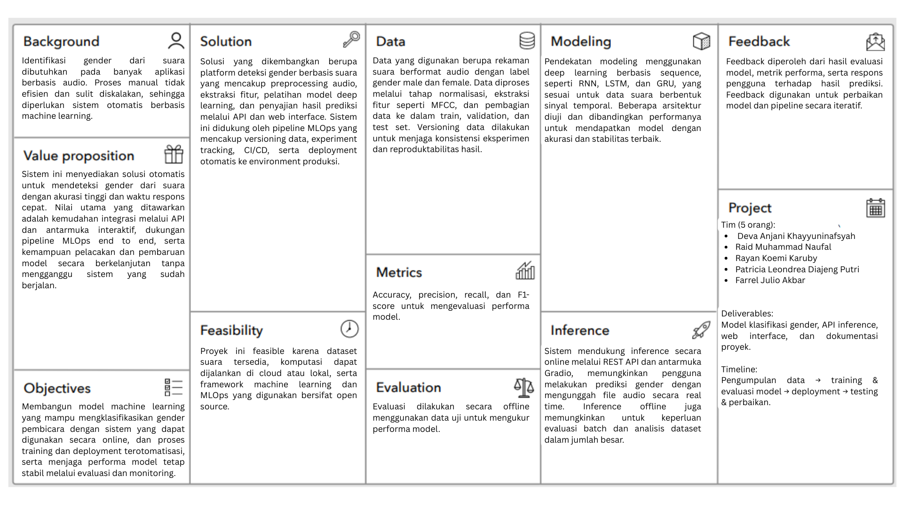
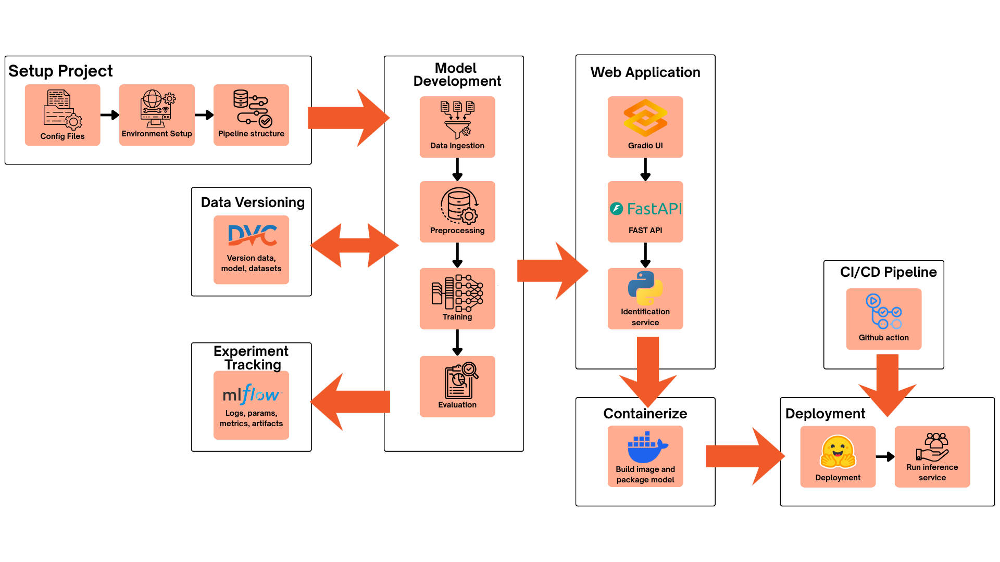

# 🎤 Gender Voice Detection - MLOps Platform

[](https://www.python.org/downloads/)
[](https://www.tensorflow.org/)
[](https://mlflow.org/)
[](https://dvc.org/)
[](https://fastapi.tiangolo.com/)
[](https://gradio.app/)
[](https://opensource.org/licenses/MIT)

> **Platform MLOps lengkap untuk deteksi gender dari suara menggunakan Deep Learning (RNN, LSTM, GRU) dengan pipeline CI/CD otomatis, experiment tracking, data versioning, dan deployment ke production.**

---

## 🧠 ML Canvas
<p align="center">  </p>

## 📋 Daftar Isi

- [Overview](#-overview)
- [Features](#-features)
- [Arsitektur](#-arsitektur)
- [Tech Stack](#-tech-stack)
- [Quick Start](#-quick-start)
- [Setup Development](#-setup-development)
- [Usage](#-usage)
- [Model Training](#-model-training)
- [Deployment](#-deployment)
- [API Documentation](#-api-documentation)
- [Project Structure](#-project-structure)
- [Contributing](#-contributing)
- [License](#-license)

---

## 🎯 Overview

Project ini adalah implementasi **full-stack MLOps pipeline** untuk deteksi gender dari audio suara menggunakan teknologi Deep Learning. Platform ini dilengkapi dengan:

- ✅ **3 Model Deep Learning**: RNN, LSTM, GRU (user bisa pilih)
- ✅ **Interactive UI**: Gradio-based web interface dengan audio recording
- ✅ **Admin Dashboard**: Manual training controls & feedback management
- ✅ **REST API**: FastAPI backend untuk integration
- ✅ **Experiment Tracking**: MLflow integration dengan DagsHub
- ✅ **Data Versioning**: DVC dengan Google Drive storage (2TB)
- ✅ **Auto-Retrain**: Feedback loop dengan automatic retraining
- ✅ **CI/CD Pipeline**: 4 GitHub Actions workflows (Lint, Test, Train, Deploy)
- ✅ **Production Ready**: Deployed ke HuggingFace Spaces

---

## ✨ Features

### 🎤 **User Features**
- **Audio Recording**: Record langsung dari microphone (3 detik)
- **File Upload**: Support .wav, .mp3, .m4a format
- **Multi-Model Selection**: Pilih model RNN/LSTM/GRU
- **Real-time Prediction**: Hasil instant dengan confidence score
- **Visualization**: MFCC features & confidence charts
- **Feedback System**: Koreksi prediksi untuk improve model
- **Prediction History**: Semua prediksi auto-record ke CSV

### 🔧 **Admin Dashboard**
- **Manual Training**: Custom epochs, learning rate, batch size
- **Feedback Management**: View, export, clear feedback data
- **Model Comparison**: Performance metrics untuk semua model
- **System Info**: Dataset stats, model info, last training time
- **Backup System**: Auto-backup sebelum clear feedback

### 🤖 **MLOps Features**
- **GitHub Actions CI/CD**: 4 automated workflows
  - 🎨 **Lint**: Code quality (Black, Flake8, isort, MyPy)
  - 🧪 **Test**: Multi-OS/Python testing with coverage
  - 🎓 **Train**: Auto-training on data updates + manual dispatch
  - 🚀 **Deploy**: Hugging Face deployment automation
- **Experiment Tracking**: All training runs logged ke MLflow
- **Model Versioning**: Automatic versioning & registry
- **Data Pipeline**: DVC-tracked preprocessing & MFCC extraction
- **Reproducibility**: Fixed seeds & version control
- **CI/CD**: Auto-test, auto-train, auto-deploy

---

## 🏗️ Arsitektur
<p align="center">  </p>
```


## 🛠️ Tech Stack

### **Deep Learning**
- TensorFlow 2.13 / Keras
- Architectures: SimpleRNN, LSTM, GRU

### **Audio Processing**
- Librosa (feature extraction)
- Soundfile (I/O)
- Noisereduce (preprocessing)

### **MLOps**
- **Experiment Tracking**: MLflow + DagsHub
- **Data Versioning**: DVC + Google Drive
- **Model Registry**: MLflow Model Registry

### **Web & API**
- **Backend**: FastAPI
- **Frontend**: Gradio
- **Authentication**: JWT + Passlib

### **CI/CD & Deployment**
- **CI/CD**: GitHub Actions
- **Containerization**: Docker
- **Deployment**: HuggingFace Spaces

### **Data Science**
- Pandas, NumPy, Scikit-learn
- Matplotlib, Seaborn, Plotly

---

## 🚀 Quick Start

### Prerequisites

- Python 3.9 atau lebih tinggi
- Git
- Google Drive account (untuk DVC)
- DagsHub account (untuk MLflow)
- HuggingFace account (untuk deployment)

### Installation

```bash
# Clone repository
git clone https://github.com/[USERNAME]/gender-voice-detection.git
cd gender-voice-detection

# Create virtual environment
python -m venv venv
source venv/bin/activate  # Linux/Mac
# atau
venv\Scripts\activate  # Windows

# Install dependencies
pip install -r requirements.txt

# Setup environment variables
cp .env.example .env
# Edit .env dengan credentials Anda

# Initialize DVC
dvc init
dvc remote add -d gdrive gdrive://[YOUR_FOLDER_ID]

# Pull data dari Google Drive
dvc pull

# Run MLflow UI (optional, jika tidak pakai DagsHub)
mlflow ui --port 5000
```

### Run Application

```bash
# Terminal 1: Run FastAPI backend
uvicorn src.api.app:app --reload --port 8000

# Terminal 2: Run Gradio UI
python src/ui/gradio_app.py
```

Akses aplikasi di: `http://localhost:7860`

---

## 💻 Setup Development

### 1. Setup Virtual Environment

```bash
python -m venv venv
source venv/bin/activate  # Linux/Mac
venv\Scripts\activate     # Windows
```

### 2. Install Dependencies

```bash
pip install -r requirements.txt
```

### 3. Setup DagsHub (MLflow Tracking)

1. Buat account di [dagshub.com](https://dagshub.com)
2. Create new repository: `gender-voice-detection`
3. Copy MLflow tracking URI
4. Update `.env`:
   ```
   MLFLOW_TRACKING_URI=https://dagshub.com/[USERNAME]/gender-voice-detection.mlflow
   MLFLOW_TRACKING_USERNAME=[YOUR_USERNAME]
   MLFLOW_TRACKING_PASSWORD=[YOUR_TOKEN]
   ```

### 4. Setup DVC + Google Drive

```bash
# Initialize DVC
dvc init

# Add Google Drive as remote
dvc remote add -d gdrive gdrive://[YOUR_FOLDER_ID]

# Configure credentials
dvc remote modify gdrive gdrive_use_service_account true
# atau login interaktif:
dvc pull  # akan prompt Google OAuth
```

### 5. Setup HuggingFace (untuk deployment)

1. Buat account di [huggingface.co](https://huggingface.co)
2. Generate access token
3. Update `.env`:
   ```
   HF_TOKEN=[YOUR_TOKEN]
   HF_REPO_ID=[USERNAME]/gender-voice-detection-id
   ```

---

## 📖 Usage

### Prediksi Gender dari Audio

#### Via UI (Gradio)

1. Buka `http://localhost:7860`
2. Tab **"Prediksi"**
3. Pilih model (LSTM/GRU/RNN)
4. Record audio atau upload file
5. Klik "Prediksi Gender"
6. Lihat hasil + visualization

#### Via API (FastAPI)

```python
import requests

# Upload audio file
files = {'audio': open('test_audio.wav', 'rb')}
data = {'model': 'lstm'}

response = requests.post(
    'http://localhost:8000/api/predict',
    files=files,
    data=data
)

result = response.json()
print(f"Gender: {result['gender']}")
print(f"Confidence: {result['confidence']:.2%}")
```

### Submit Feedback

```python
# Koreksi prediksi yang salah
feedback = {
    'audio_id': 'pred_12345',
    'predicted': 'Laki-laki',
    'corrected': 'Perempuan',
    'audio_data': audio_base64
}

response = requests.post(
    'http://localhost:8000/api/feedback',
    json=feedback
)

print(response.json())
# Output: {"status": "saved", "feedback_count": 15, "next_retrain": "5 lagi"}
```

---

## 🧠 Model Training

### Quick Train (Default Parameters)

```bash
python src/training/train.py --model lstm
```

### Custom Training

```bash
python src/training/train.py \
  --model lstm \
  --epochs 100 \
  --batch-size 32 \
  --learning-rate 0.0005 \
  --dropout 0.3 \
  --hidden-units 128
```

### Train All Models (Baseline Comparison)

```bash
python src/training/train_all.py
```

Output akan di-log ke MLflow dengan perbandingan:
- Accuracy, Precision, Recall, F1-Score
- Training time & inference time
- Confusion matrix
- Loss curves

### Via UI (Parameter Tuning Tab)

1. Buka Tab **"Parameter Tuning"**
2. Pilih model(s)
3. Adjust hyperparameters dengan sliders
4. Klik "Start Training"
5. Monitor real-time progress
6. Download PDF report setelah selesai

---

## 🌐 Deployment

### Docker

```bash
# Build image
docker build -t gender-voice-detection .

# Run container
docker run -p 7860:7860 -p 8000:8000 gender-voice-detection
```

### HuggingFace Spaces

```bash
# Login to HF CLI
huggingface-cli login

# Push to HF Hub
python scripts/deploy_to_hf.py
```

Atau manual:
1. Create new Space di HuggingFace
2. Push code ke HF repo
3. Add secrets di Space settings
4. Auto-deploy via GitHub Actions

---

## 📚 API Documentation

FastAPI auto-generated docs:
- Swagger UI: `http://localhost:8000/docs`
- ReDoc: `http://localhost:8000/redoc`

### Main Endpoints

```
POST   /api/predict         - Predict gender dari audio
POST   /api/feedback        - Submit feedback correction
POST   /api/train           - Trigger custom training
GET    /api/train/status    - Check training progress
GET    /api/metrics         - Get performance metrics
POST   /api/admin/retrain   - Manual retrain (admin only)
GET    /health              - Health check
```

---

## 📁 Project Structure

```
gender-voice-detection/
├── .github/workflows/       # CI/CD pipelines
├── data/                    # DVC-tracked data
│   ├── raw/
│   ├── processed/
│   ├── mfcc/
│   └── feedback/
├── models/                  # Trained models (.h5)
├── notebooks/               # Jupyter notebooks
│   └── Tubes_MLOPS.ipynb
├── src/
│   ├── preprocessing/       # Audio preprocessing & MFCC
│   ├── training/            # Training scripts
│   ├── api/                 # FastAPI backend
│   ├── ui/                  # Gradio frontend
│   └── utils/               # Helper functions
├── tests/                   # Unit & integration tests
├── reports/                 # Training reports (PDF/CSV)
├── logs/                    # Application logs
├── .env.example             # Environment template
├── requirements.txt         # Dependencies
├── Dockerfile               # Container definition
├── dvc.yaml                 # DVC pipeline
└── README.md
```

---

## 🧪 Testing

```bash
# Run all tests
pytest

# With coverage
pytest --cov=src --cov-report=html

# Specific test
pytest tests/test_api.py -v
```

---

## 📊 Monitoring

- **MLflow UI**: Tracking experiments & metrics
- **Gradio Analytics**: Built-in usage stats
- **FastAPI Logs**: Request/response logging
- **Model Performance**: Auto-logged metrics per prediction

---

## 🤝 Contributing

1. Fork repository
2. Create feature branch (`git checkout -b feature/amazing-feature`)
3. Commit changes (`git commit -m 'Add amazing feature'`)
4. Push to branch (`git push origin feature/amazing-feature`)
5. Open Pull Request

---

## 📄 License

This project is licensed under the MIT License - see the [LICENSE](LICENSE) file for details.

---

## 👥 Authors

- Deva Anjani Khayyuninafsyah
- Raid Muhammad Naufal
- Rayan Koemi Karuby
- ⁠Patricia Leondrea Diajeng Putri
- ⁠Farrel Julio Akbar
---

**⭐ Star project ini jika bermanfaat!**
